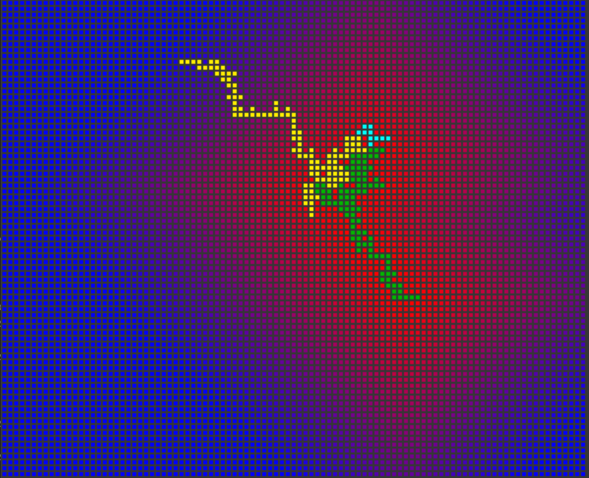

## Filler

#### Game rules
In this game, two players fight each other. They play one after the other.<br>
The goal is to collect as many points as possible by placing the highest number of ,pieces on the the game board<br>.
At the beginning of each turn, each one of the player will receive a game piece.
A game piece is defined by X columns and N lines, so it will be X * N cells.<br>
Inside each game piece, will be included a shape of one or many cells.<br>
To be able to place a piece on the board, it is mandatory that one, and only one
cell of the shape covers the cell of your shape placed previously.
The shape must not exceed the dimensions of the board.<br>
When the game starts, the board already contains one shape.<br>
The game stops at the first error: either when a game piece cannot be placed
anymore or it has been wrongly placed.<br>

Map example:
```c
Plateau 14 30:
    012345678901234567890123456789
000 ..............................
001 ..............................
002 ..X...........................
003 ..............................
004 ..............................
005 ..............................
006 ..............................
007 ..............................
008 ..............................
009 ..............................
010 ..............................
011 ...........................O..
012 ..............................
013 ..............................
```
---

#### Algorithm

My algorithm tries to suffocate the opposite player, for if every piece around<br>
the opposite player is not free the player cant place new pieces.<br>
To accomplish that I use something reminiscent of minesweeper.<br>
Each round a give each empty square a value calculated by the closest enemy piece to the square.<br>
```c
value = pos(enemy_square.y - empty_square.y) + pos(enemy_square.x - empty_square.x);
```
Visualization: the more read the closer the empty square is to the green square.
</n>
Then when placing a piece I calculate for each possible position, total value of overlapped pieces.<br>
Meaning if I have a 2x2 square and one of the corners overlaps my pieces sum of remaining 3 empty square,
the 3 empty square values ard up.<br>
The position with the least value is the optimal placement.<br>

</n>
---

#### How to Use

```sh
https://github.com/Epicurius/filler.git
cd filler && make && cd vis && make && cd ../

./run.sh
#	OR replace PLAYER_1, PLAYER_2 and MAP
./oldfiller_vm -p1 ./PLAYER_1 -p2 ./PLAYER_1 -f ./resources/maps/MAP | ./vis/vis
```

---